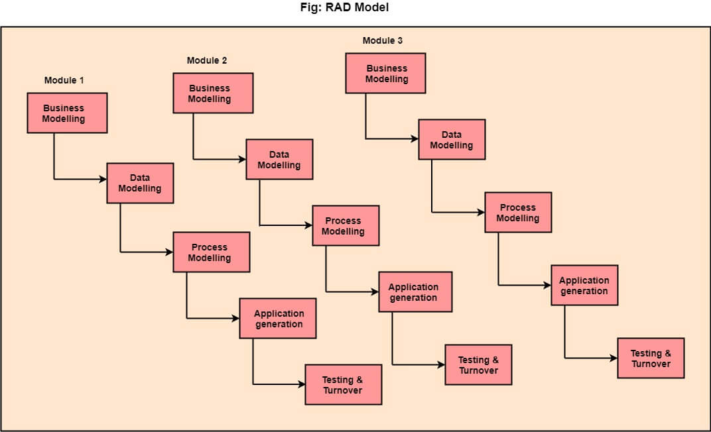

# Software_Engg

## **Software Engineering**
- Software Engineering provides a standard procedure to design and develop a software.

> **Software is a collection of integrated programs**

- 

- Software Engineering is an engineering branch related to the evolution of software product using well-defined scientific principles, techniques, and procedures. The result of software engineering is an effective and reliable software product.

## Why Software Engineering?
***
- Software Engineering is require:-
 - **To Manage Software**
 - **Modularity**
   - It's simpler to manufactur a wall than a building or house
 - **Adaptability**
   - Simpler to re-create new software than to scale an existing one.
 - **For More Scalability**
   - The capacity to be changed in size or scale.
 - **Manage Dynamic Nature of Software**
   - The quality of the software is continually changing, new upgrades need to be done in the existing one
 - **For Better Quality Management**
   - Better procedure of software development provides a better and quality software product
 - **Cost Management**
   - The cost of Software remains high if the proper process is not adapted while developing software
   

## Importance of Software Engineering
***
- 

## Characteristics of a good software engineer
 ***
 - Familiar With Software Engineering Principles
 - Good Technical Knowledge of Domain and Projects
 - Good Programming Skills
 - Team Work
 - Good Verbal and Written Skills

## Software Processes
***
- A software process is the set of activities and associated outcome that produce a software product.

- **Software Specifications**
  - The functionality of the software and constraints on its operation must be defined
 
- **Software Development**
  - The software to meet the requirement must be produced
  
- **Software validation**
  - The software must be validated to ensure that it does what the customer wants

- **Software Evolution**
  - The software must evolve to meet changing client needs.
  
- 3 Components of software, **Software = Program + Documentation  + Operating Procedures**
- [x] **Program**
  - Program is a combination of source code & object code
  - 
- [x] **Documentation**
  -  Documentation consists of different types of manuals like Data Flow Diagram, Flow Charts, ER diagrams, etc
  
  - 

- [x] **Operating Procedures**

   - Operating Procedures consist of instructions to set up and use the software system and instructions on how react to the system failure like installation guide, Beginner's guide, reference guide, system administration guide, etc.
   - 

## Software Development Life Cycle (SDLC)
***
- SDLC is a process used by the software industry to design, develop and test high quality softwares
- The SDLC aims to produce a high-quality software that meets or exceeds customer expectations, reaches completion within times and cost estimates
- SDLC is a framework defining tasks performed at each step in the software development process.

> ***It is also called as Software Development Process.***

- **Why Need SDLC?**
- The development team must determine a suitable life cycle model for a particular plan and then observe to it.

- 

- **1. Planning and Requirement Analysis**
  > ***t is performed by the senior members of the team with inputs from the customer, the sales department, market surveys and domain experts in the industry***

- **2. Defining Requirements**
  > *** document the software requirements and get them accepted from the project stakeholders***
  > **"SRS"- Software Requirement Specification document which contains all the product requirements to be constructed and developed during the project life cycle.** 

- **3. Designing the Software**
  > *** This phase is about to bring down all the knowledge of requirements, analysis, and design of the software project. This phase is the product of the last two, like inputs from the customer and requirement gathering.***

- **4. Building or Developing the Product (Coding)**
  > ***In this phase of SDLC, the actual development begins, and the programming is built. The implementation of design begins concerning writing code. Developers have to follow the coding guidelines described by their management and programming tools like compilers, interpreters, debuggers, etc. are used to develop and implement the code.***  

- **5. Testing**
  > ***After the code is generated, it is tested against the requirements to make sure that the products are solving the needs addressed and gathered during the requirements stage.***

- **6. Deployment**
  > ***Once the software is certified, and no bugs or errors are stated, then it is deployed.***

- **7. Maintenance**
  > ***Once when the client starts using the developed systems, then the real issues come up and requirements to be solved from time to time.***
  
  
  

## **SDLC Models**
***
- There are different software development life cycle models specify and design, which are followed during the software development phase.
- 

### **Waterfall Model**
  - Universally accepted SDLC model
  - Linear-sequential life cycle model.
  - Very Simple to Understand and Use
  - In a waterfall model, each phase must be completed before the next phase can begin and there is no overlapping in the phases.
  - 

### When to use SDLC Waterfall Model?
- **When the requirements are constant and not changed regularly**
- **Where the tools and technology used is consistent and is not changing**
- **When resources are well prepared and are available to use.**
- **A project is short & Situation is calm**

### Advantages of Waterfall model
- Simple and easy to understand and use
- start and end points for each phase is fixed, which makes it easy to cover progress.
- Release date for the complete product, as well as its final cost, can be determined before development.
- It gives easy to control and clarity for the customer due to a strict reporting system.
- Easy to arrange tasks
- Process and results are well documented.

### Disadvantages of Waterfall model
- No working software is produced until late during the life cycle.
- High amounts of risk and uncertainty.
- Poor model for long and ongoing projects.
- Cannot accommodate changing requirements.
- It becomes tough to go back to the phase
- Since the testing done at a later stage, it does not allow identifying the challenges and risks in the earlier phase

### RAD Model
  - Rapid Application Development process is an adoption of the waterfall model
  - Targets developing software in a short period
  
- RAD (Rapid Application Development) is a concept that products can be developed faster and of higher quality through:
  - **Gathering requirements using workshops or focus groups**
  - **Prototyping and early, reiterative user testing of designs**
  - **The re-use of software components**
  - **A rigidly paced schedule that refers design improvements to the next product version**
  - **Less formality in reviews and other team communication**

- 

### When to use RAD Model?
- When the system should need to create the project that modularizes in a short span time (2-3 months)
- When the requirements are well-known.
- When the technical risk is limited.
- It should be used only if the budget allows the use of automatic code generating tools

### Advantage of RAD Model
- This model is flexible for change.
- It reduced development time.
- It increases the reusability of features.
- Each phase in RAD brings highest priority functionality to the customer

### Disadvantage of RAD Model
- It required highly skilled designers.
- All application is not compatible with RAD
- For smaller projects, we cannot use the RAD model
- On the high technical risk, it's not suitable
- Required user involvement

### Iterative Model
- In the Iterative model, iterative process starts with a simple implementation of a small set of the software requirements and iteratively enhances the evolving versions until the complete system is implemented and ready to be deployed.
  - Does not attempt to start with a full specification of requirements
  - Begins by specifying and implementing just part of the software
  
- 

- Iterative and Incremental development is a combination of both iterative design or iterative method and incremental build model for development.

- During software development, more than one iteration of the software development cycle may be in progress at the same time

- In this incremental model, the whole requirement is divided into various builds

- During each iteration, the development module goes through the requirements, design, implementation and testing phases

### Advantages of Iterative Model
- Some working functionality can be developed quickly and early in the life cycle.
- Parallel development can be planned.
- Testing and debugging during smaller iteration is easy.
- Progress can be measured
- Risks are identified and resolved during iteration; and each iteration is an easily managed milestone
- Better suited for large and mission-critical projects.

### Disadvantages of Iterative Model
- More resources may be required.
- Although cost of change is lesser, but it is not very suitable for changing requirements
- More management attention is required.
- Not suitable for smaller projects

### Iterative Model - Application
- Requirements of the complete system are clearly defined and understood
- Major requirements must be defined; however, some functionalities or requested enhancements may evolve with time
- There are some high-risk features and goals which may change in the future.

 

### Spiral Model
   - The spiral model combines the idea of iterative development with the systematic, controlled aspects of the waterfall model
   - combination of iterative development process model and sequential linear development model
   
   
- 

- Each cycle in the spiral is divided into four parts
  - **1. Objective setting**
  - **2. Risk Assessment and reduction**
  - **3. Development and validation**
  - **4. Planning**

### When to use Spiral Model?
- When deliverance is required to be frequent
- When the project is large
- When requirements are unclear and complex
- When changes may require at any time
- Large and high budget projects

### Advantages of Spiral Model
- High amount of risk analysis
- Useful for large and mission-critical projects.

### Disadvantages of Spiral Model
- Can be a costly model to use.
- Risk analysis needed highly particular expertise
- Doesn't work well for smaller projects
- Users see the system early
- Process is complex
- Spiral may go on indefinitely.

###  Agile Model
   - The meaning of Agile is swift or versatile
   - Agile process model" refers to a software development approach based on iterative development
   - Agile methods break tasks into smaller iterations, or parts do not directly involve long term planning
   - Agile Methods break the product into small incremental builds
   -  All of these builds are provided in iterations, and each iteration lasts from one to three weeks
  
- 

- **Phases of Agile Model**
  - **1. Requirements gathering**
  - **2. Design the requirements**
  - **3. Construction/ iteration**
  - **4. Testing/ Quality assurance**
  - **5. Deployment**
  - **6. Deployment**
  - **7. Feedback**
  
- **Agile Testing Methods:**
  - **Scrum**
  - **Crystal**
  - **Dynamic Software Development Method(DSDM)**
  - **Lean Software Development**

### When to use the Agile Model?
- When project size is small
- When frequent changes are required
- When a highly qualified and experienced team is available
- When a customer is ready to have a meeting with a software team all the time

### Advantage of Agile Model
- Frequent Delivery
- Efficient design and fulfils the business requirement
- Anytime changes are acceptable
- Face-to-Face Communication with clients
- It reduces total development time

### Disadvantages of Agile Model
- Due to the shortage of formal documents, it creates confusion and crucial decisions taken throughout various phases can be misinterpreted at any time by different team members
- Due to the lack of proper documentation, once the project completes and the developers allotted to another project, maintenance of the finished project can become a difficulty
